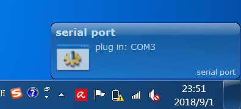

SerialPortNotification
======================

在usb转串口设备插入或拔出电脑时，在系统托盘进行提示, 需要先安装[Growl for Windows](http://www.growlforwindows.com/gfw/default.aspx),

参考资料:
[Growl Integration Guide](http://www.growlforwindows.com/gfw/d.ashx?f=Growl%20for%20Windows%20-%20Application%20Integration%20Guide.doc)

[Growl_NET_Connector_SDK](http://www.growlforwindows.com/gfw/d.ashx?f=connectors/Growl_NET_Connector_SDK.zip)

[SerialPort Class](https://docs.microsoft.com/zh-cn/dotnet/api/system.io.ports.serialport?redirectedfrom=MSDN&view=netframework-4.7.2)